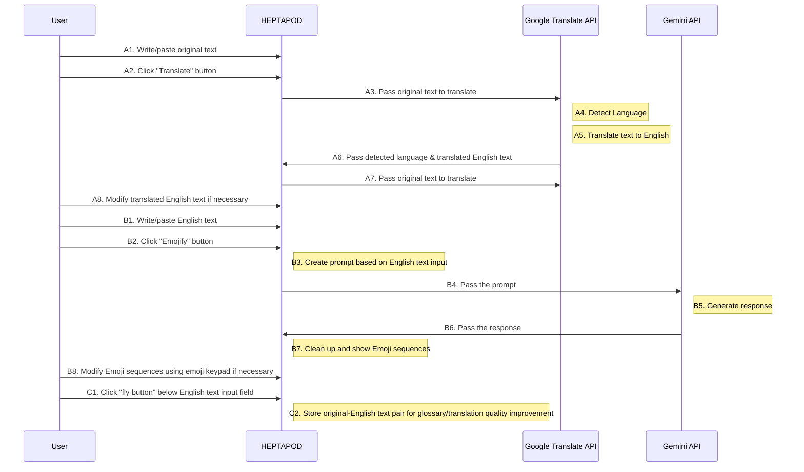
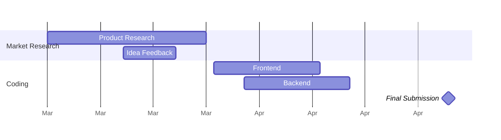

Designed and coded by [Erela](https://linkedin.com/in/erela-yang-snow).

**Table of Contents**
- [Demo of the application](#demo-of-the-application)
- [User story](#user-story)
- [User flows](#user-flows)
- [How to try our app](#how-to-try-our-app)
- [Project Timeline](#project-timeline)
- [Future Directions](#future-directions)

## Demo of the application
Links: 
- [Deployed website](https://heptapod.netlify.app/)
- [Demo video](https://youtu.be/lN2qxyEwniY)

Below are some pictures from web application.

<div style="display: flex; flex-wrap: wrap; justify-content: space-between;">

    Home Page


</div>
 
<div style="display: flex; flex-wrap: wrap; justify-content: space-between;">

    Language Translation (Korean to English)


</div>
    
    
<div style="display: flex; flex-wrap: wrap; justify-content: space-between;">

    Text to Emoji (aka Emojify)


</div>
        
<div style="display: flex; flex-wrap: wrap; justify-content: space-between;">
    
    Whcn clicking Information Icon on the top-right corner, you will see "how to use heptapod" modal
    


</div>

<div style="display: flex; flex-wrap: wrap; justify-content: space-between;">
    
    Whcn clicking Question Icon next to the detected language, you will see "Language Detection Disclaimer" modal


    

</div>


## User story

There are three ways to use HEPTAPOD.
```gherkin=
Feature: Text Translation

  Scenario: User wants to detect the original language and translate it
    When I write/paste the original text
    And click translate button
    Then I see corresponding English translated text
    And can revise it if necessary or copy the text

```
```gherkin=
Feature: Emojify translated English Text

  Scenario: User wants to generate emojis corresponding translated English text
    When I click Emojify button 
    Then I see sequence of emojis with ending punctuation marks that match English text
    And can revise it using Emoji keypad if necessary or copy the emoji sequences
```
```gherkin=
Feature: Emojify English Text

  Scenario: User wants to generate emojis corresponding English text
    Given I did not user translation
    When I write/paste the English text 
    And I click Emojify button
    Then I see sequence of emojis with ending punctuation marks that match English text
    And can revise it using Emoji keypad if necessary or copy the emoji sequences
```


## User flows
---

In the following user flows, we show 

- 3 features
    - A: Translate a text to English text
    - B: Generate Emojis based on English Text
    - C: Add glossary



## How to try our app

Follow the following 5 steps to try our web application locally.

1. Clone our repository `git clone <url>`
2. In heptapod repo, create .env file and store these variables:
    - `GOOGLE_GEMINI_API_KEY`
    - `GOOGLE_PROJECT_ID`

3. In the same repo, run `npm install` to install dependencies
4. Then, run `npm start` to start the backend of the app
5. Run `cd frontend` to move to frontend section
6.  `npm install` to install dependencies
7.  Run`npm start` to start the app and you can check the results on http://127.0.0.1:3000/ in your browser


## Project Timeline
---
Here is rough timeline of project




## Future Directions
---

If I have more time to develop, here are some  features that could be meaningful to implement on top of the current version.
- Use accumulated glossary to tune language model
- Highlight corresponding sentences in both the emoji and original input text to enhance comprehension and usability
- Integrating dictionaries into the English text, like Papago translation does, to aid users in understanding nuanced meanings and expressions 

<div style="display: flex; flex-wrap: wrap; justify-content: space-between;">

    Korean dictionary appears when I highlighted Korean word on Papago


</div>