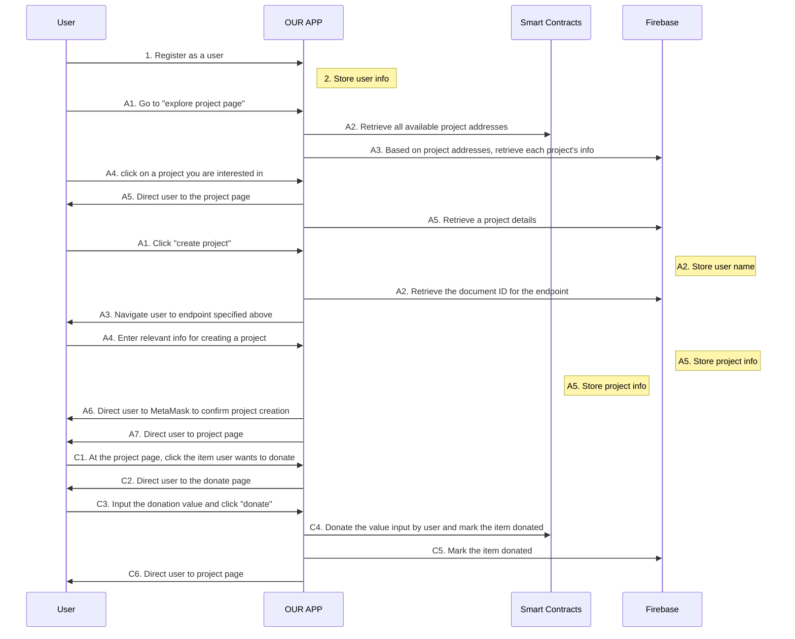
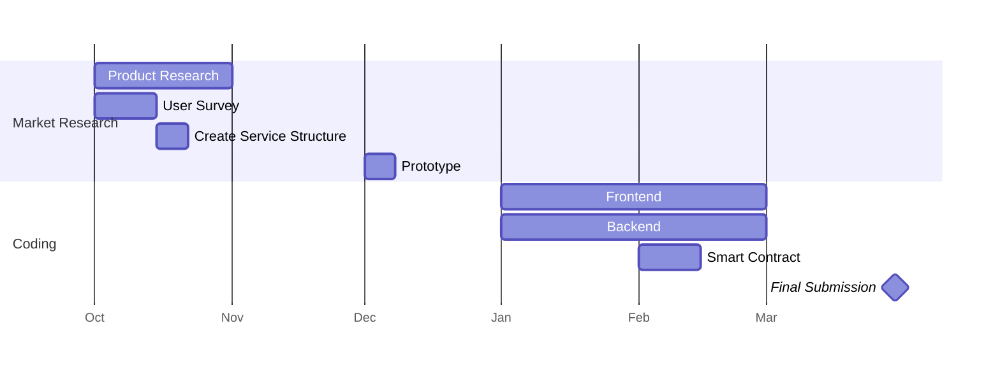

HEPTAPOD
===

:tada: my college's final assignment - dedicated to Migration and Border tutorial.

"HEPTAPOD" is a multi-modal translation software, involving both text-to-text and text-to-emoji auto translation.
The inspiration stems from the insufficient translation resources during the asylum-seeking process; I aim to overcome the communication gap through employing both text and emoji as the medium.


Designed and coded by [Erela](https://linkedin.com/in/erela-yang-snow).

**Table of Contents**

- [HEPTAPOD](#heptapod)
  - [Demo of the application](#demo-of-the-application)
  - [User story](#user-story)
  - [How to use our app](#how-to-use-our-app)
  - [User flows](#user-flows)
  - [Project Timeline](#project-timeline)

## Demo of the application
Links: 
- [Deployed website](https://forward-capstone.netlify.app/)
- [Demo video - sign up process](https://www.canva.com/design/DAGBTkRZTOs/FJgozfYMvuJ2XwPtYTpkHg/watch?utm_content=DAGBTkRZTOs&utm_campaign=designshare&utm_medium=link&utm_source=editor)

Below are some pictures from web application.

<div style="display: flex; flex-wrap: wrap; justify-content: space-between;">

    Home Page


</div>
 
<div style="display: flex; flex-wrap: wrap; justify-content: space-between;">

    Language Translation (Korean to English)


</div>
    
    
<div style="display: flex; flex-wrap: wrap; justify-content: space-between;">

    Text to Emoji (aka Emojify)


</div>
        
<div style="display: flex; flex-wrap: wrap; justify-content: space-between;">
    
    Whcn clicking Information Icon on the top-right corner, you will see "how to use heptapod" modal
    


</div>

<div style="display: flex; flex-wrap: wrap; justify-content: space-between;">
    
    Whcn clicking Question Icon next to the detected language, you will see "Language Detection Disclaimer" modal


    

</div>


## User story

```gherkin=
Feature: List campaign

  Scenario: User wants to create a new campaign
    Given I'm a logged-in User
    When I go to the Main page
    And I search for a location
    Then I see the safety score of the location
    And receive advice on safety measures

```
```gherkin=
Feature: Donate Campaign

     Scenario: User wants to donate to a campaign
    Given I'm a logged-in User
    When I go to campaign page
    And I find campaign I am interested in supporting
    Then I click the item to donate
    And transfer donation safely via blockchain
```
<!-- 
```gherkin=
Feature: Send an emergency signal to chosen contacts

  Scenario: User is in a dangerous situation
    Given I'm a logged-in User
    When I go to the Main page
    And I click "Emergency" for 3 seconds
    Then my chosen contacts are notified about an emergency 
    with my geolocation  
    And I receive directions to the closest safe place
```
```gherkin=
Feature: Find the closest safe location

  Scenario: User feels unsafe
    Given I'm a logged-in User
    When I go to the Main page
    And I click on any of the bookmarked safe places
    Then the app calculates the route
    And I see the route information on Google Maps
```
 -->


## How to use our app


Follow the following 5 steps to try our web application.

1. Clone our repository `git clone <url>`
2. In heptapod repo, create .env file and store these variables:
    - DEEPL_API_KEY
    - EDENAI_API_KEY (from Eden AI - a service centralizing AI related APIs)
    - GOOGLE_PROJECT_ID
    - PROMPT_INPUT1 (for the following 3 fields, you can ask the author directly for testing)
    - PROMPT_INPUT2
    - PROMPT_INPUT3
3. In the same repo, run `npm install` to install dependencies
4. Then, run `npm start` to start the backend of the app
5. Run `cd frontend` to move to frontend section
6.  `npm install` to install dependencies
7.  Run`npm start` to start the app and you can check the results on http://127.0.0.1:3000/ in your browser


## User flows
---

In the following user flows, we show 

- the user registration process (Numbered `1-2`)
- 3 features
    - A: Browse campaigns
    - B: Create a campaign
    - C: Donate to a campaign




## Project Timeline
---
The times provided are in GMT.




<!-- ## Future Directions
---

If we have more time to develop, here are some  features we find meaningful to implement on top of the current version.
- Expansion to more cities across the US and beyond
- Community features
- Widget on mobile devices to activate the nearest safe location search
- Call a car-sharing application/taxi to pick you up when you're in danger
- Motion tracker empowered by Machine Learning
 -->